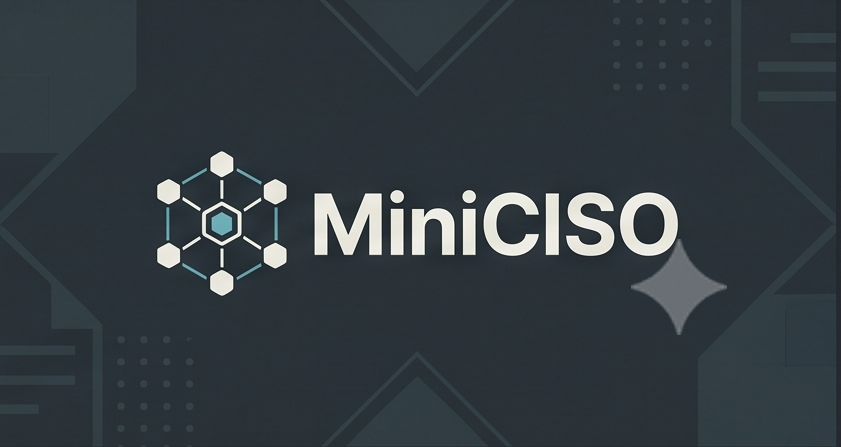

<p align="center">
  
</p>

<p align="center">
  <a href="https://github.com/icidade/miniCISO/releases"></a>
  <a href="https://github.com/icidade/miniCISO/actions/workflows/validate.yml"></a>
  <a href="LICENSE"></a>
  <a href="https://patreon.com/miniciso"></a>
</p>

# MiniCISO

[Hermes Agent](https://github.com/NousResearch/hermes-agent) is a self-improving AI agent runtime with tools, persistent knowledge, reusable skills, scheduled automation, and support for multiple model providers.

MiniCISO builds on that runtime as an agentic security staff, distributed as a reproducible overlay of profiles, prompts, templates, and operating policies.

> This repository is **not a Hermes fork**. MiniCISO is a public overlay installed on top of a Hermes runtime pinned by version and commit in [`config/hermes-version.env`](config/hermes-version.env).

## Why MiniCISO

MiniCISO packages a reusable security operating model around Hermes:
- a `chief-of-staff` coordinator for intake, routing, synthesis, and QA enforcement;
- specialized security SMEs for threat modeling, architecture, code review, AppSec, compliance, offensive validation, recon, and QA;
- evidence-driven workflows with explicit gates for finding validation and post-submission follow-up.

It is designed to help a human operator run structured security engagements more consistently. It does **not** replace human authorization, judgment, or accountable decision-making.

## Quick restore

### Windows (PowerShell)

```powershell
git clone https://github.com/icidade/miniCISO.git
cd miniCISO
.\scripts\bootstrap.ps1
```

### Linux, macOS, or WSL2

```bash
git clone https://github.com/icidade/miniCISO.git
cd miniCISO
./scripts/bootstrap.sh
```

The bootstrap restores the pinned Hermes runtime, creates the MiniCISO profile set, installs the overlay prompts and templates, prepares the shared workspace, and runs structural checks.

Credentials requested by `hermes setup` stay in the user's Hermes environment. They are never copied into this repository.

## Security staff at a glance

MiniCISO ships the following public profile set:
- `chief-of-staff`
- `security-threat-modeling`
- `security-architecture`
- `security-code-review`
- `security-appsec-assessment`
- `security-compliance-mapper`
- `security-offensive-security`
- `security-recon-attack-surface-strategist`
- `security-qa`

For responsibilities, handoffs, and usage examples, see the wiki staff guide and the canonical profile contract in [`docs/profile-setup.md`](docs/profile-setup.md).

## Validate the installation

Offline repository validation:

```powershell
.\scripts\validate-repo.ps1
```

```bash
./scripts/validate-repo.sh
```

Runtime smoke test after bootstrap:

```powershell
.\scripts\smoke-test.ps1
```

```bash
./scripts/smoke-test.sh
```

Use `-Online` / `--online` only when you want to send a real question to each profile using the configured provider.

## Security and privacy

This repository contains only non-secret configuration and sanitized public content. Do **not** publish `.env` files, tokens, sessions, memories, logs, real reports, or unsanitized evidence. See [`SECURITY.md`](SECURITY.md) and [`.env.example`](.env.example).

## External finding workflow

For external vulnerability or bug bounty work, report drafting starts only after a `GO` decision. `RESEARCH` means produce an impact-validation plan, and `NO-GO` means block submission and capture the lesson learned.

Canonical sources:
- [`docs/kag-finding-validation.md`](docs/kag-finding-validation.md)
- [`templates/finding-decision-template.md`](templates/finding-decision-template.md)
- [`docs/submission-followup.md`](docs/submission-followup.md)
- [`templates/submission-followup-template.md`](templates/submission-followup-template.md)

## Safe overlay self-update

MiniCISO can maintain a public, sanitized copy of selected runtime-safe artifacts without publishing private state. See [`docs/self-update-capability.md`](docs/self-update-capability.md).

## Documentation map

### Start here
- [Project Wiki](https://github.com/icidade/miniCISO/wiki)
- [Installation Guide](INSTALL.md)
- [Security Policy](SECURITY.md)

### Getting started
- [Installation and restoration](INSTALL.md)
- [Profile setup contract](docs/profile-setup.md)
- [README vs docs vs Wiki](docs/readme-docs-wiki-boundary.md)

### Architecture and operating model
- [Staff operating model](docs/staff-operating-model.md)
- [Repo architecture](docs/repo-architecture.md)
- [Repo mapping](docs/repo-mapping.md)
- [Headroom + KAG selective retrieval](docs/headroom-kag-selective-retrieval.md)

### Finding validation and follow-up
- [KAG-oriented finding validation](docs/kag-finding-validation.md)
- [External submission follow-up](docs/submission-followup.md)

### Operations
- [Dependencies and configuration](docs/dependencies-and-configuration.md)
- [Safe self-update capability](docs/self-update-capability.md)
- [GitHub PR access from the VPS](docs/github-pr-access.md)


## License

[MIT](LICENSE). Hermes Agent is a separate project and keeps its own license.
